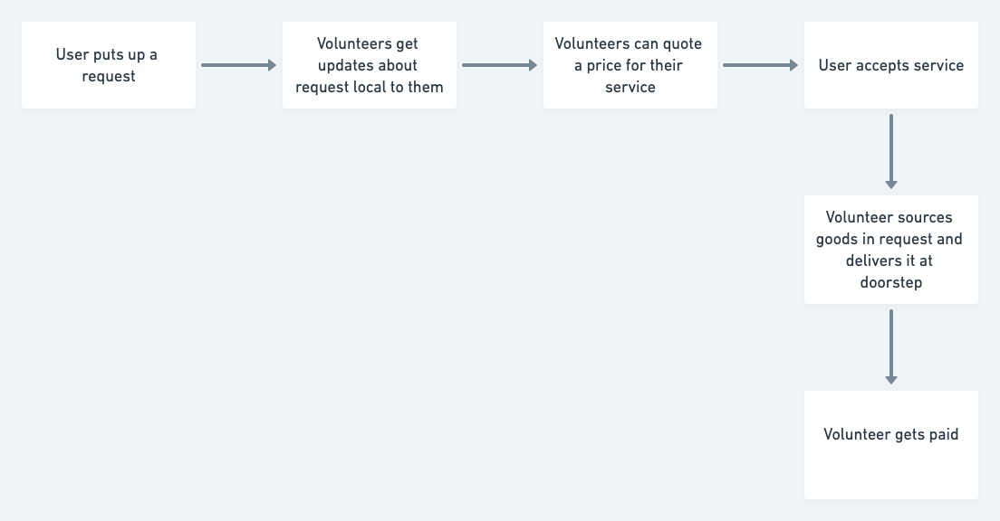

<h1 align=center>Deliverable</h1>
<p align=center>Deliveries in the time of Corona</p>

## Motivation

People have been home quarantining themselves for last couple of weeks all around the world to break the spread of Corona Covid19. While the technique has worked wonders to reduce the number of community spreads, the resource issue has been looming in large.

1. People cannot step out to make purchases. This leads to hoarding goods and resources.
2. People with the fever or symptoms cannot find ways to alert the authorities about their needs and have it delivered to them.

While there are services in some cities to deal with these scenarios with strong delivery networks, the situation is not the same in rural areas.

## Aim

The web application is build to:

- Help people in all areas and economic standards have access to deleveries of essentials to their home quarantines.
- Help government organizations and NGOs in delivering essentials to quantined people.

## The Flow



<details>
  <summary>What can user make a request for?</summary>
  
  Most delivery apps usually start with user selecting from a list of available items. We currently do not have the luxury for this as such a feature requires store owners to update their stock onto the application. This is not possible to achieve without business support in a short window.

User can make a request for any goods under categories of Medicine, Groceries, Food, Stationary or other resources (Suggestions welcome!).

</details>

<details>
  <summary>How can be volunteers?</summary>
  
  * Government agencies/NGOs who have appointed people taking required measures.
  * Daily wage workers who find themselves out of job and requires a physical job keeping themselves in the locality but out of danger's way.
  * Youth who can volunteer time and effort to help elderly and people who are at risk.
</details>

<details>
  <summary>How is payment handled?</summary>
  
  While we would like have credit card and all sorts of payment ready, this would directly conflict with our aim of app being ready for use in _all areas_. Also including something like credit cards brings up the question of credit card fees, taxes and other.

We can always try to include specific accounts by which people can pay each other for their services, like Paypal or UPI ID in India, but a cash transaction is also likely in areas.

This will not be handled in the software level and is supposed to be handled in person.

</details>

_Please raise an issue for any more questions and we can discuss._

## The Stack

The web application is setup with [NextJS](https://nextjs.org/) and [Firebase](https://firebase.google.com/).

Styling is done with [styled-components](https://styled-components.com/) and ready made components with [Ant Design](https://ant.design/)

Location based filtering can be performed with [GeoFire](https://github.com/firebase/geofire-js) and Map can be done with [Google Maps](https://developers.google.com/maps/documentation)

<details>
  <summary>Why this particular stack?</summary>

Effort is for keeping the stack as simple as possible so that a large number of people can collaborate.

NextJS choosen for it's for [Automatic Static Optimisation](https://nextjs.org/docs/advanced-features/automatic-static-optimization) features and ability to switch to Server Side Rendering if necessary.

Firebase is free and should keep us afloat without asking for donations for a long period of time.

</details>

_If you have concerns or feel another stack can have considerable advantages, create an issue._

## Contributing

PRs, Issues, Documentation are always welcome. 

Please have NodeJS >= 10 and NPM >= 6
To start developing:

```
npm i
npm dev
```